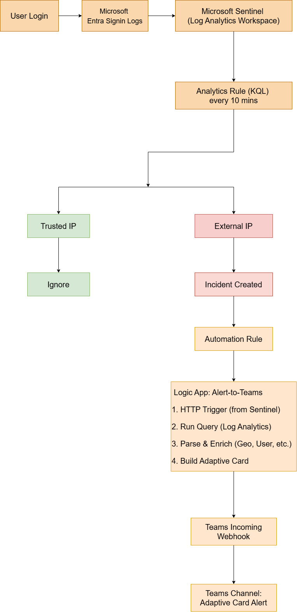
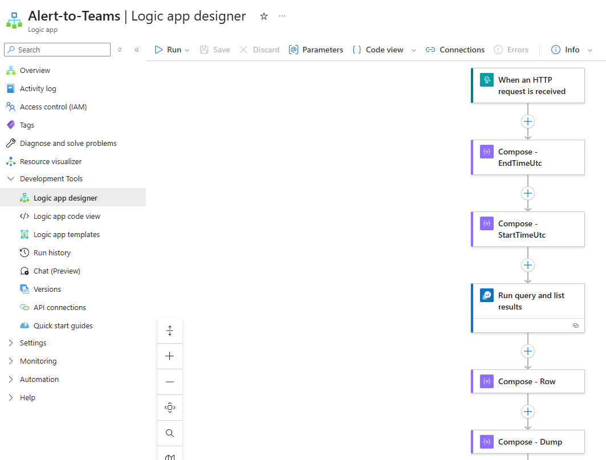
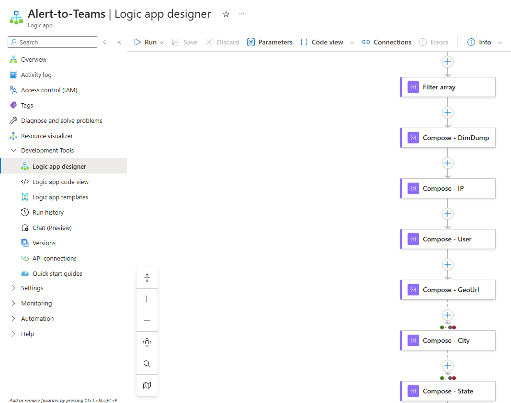
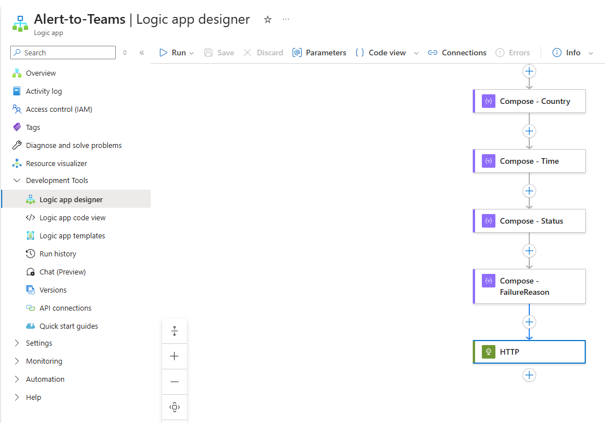
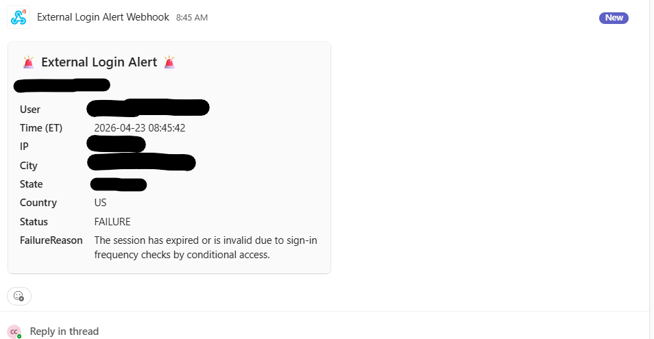

# Corporate IP Geolocation & External Login Detection System

> Real-time detection of corporate account sign-ins from outside the trusted corporate IP range, enriched with geolocation data and delivered as adaptive Microsoft Teams alerts via Microsoft Sentinel and Logic Apps.

**Duration:** September 2025 – October 2025
**Role:** Cybersecurity Specialist (Sole Architect & Implementer)

---

## 📌 Overview

### Background
The company had two closely related security concerns:

1. **Real suspicious sign-in activity was observed** — Login attempts from IP ranges that did not belong to any corporate location surfaced in audit logs, raising concern about potential credential compromise or unauthorized access.
2. **Manual log review was inefficient and unscalable** — Until then, unusual sign-ins were detected only when someone manually inspected Entra ID sign-in logs. This reactive, human-dependent process created a wide window between a potential compromise and its discovery.

### Goal
Shift from **reactive log review** to a **proactive, near real-time detection pipeline** that:
- Automatically detects every sign-in from outside the corporate IP range.
- Enriches the event with **geolocation** (city, state, country) for quick triage.
- Delivers a **structured Adaptive Card alert** to a dedicated Microsoft Teams channel within minutes.

---

## 🏗️ Architecture



### End-to-End Flow

| Step | Component | Action |
|---|---|---|
| 1 | **Microsoft Entra ID** | User sign-in events are logged to `SigninLogs` |
| 2 | **Microsoft Sentinel** (Log Analytics Workspace) | Ingests `SigninLogs` via built-in Data Connector |
| 3 | **Analytics Rule (KQL)** | Runs every **10 minutes**; flags sign-ins from IPs outside the trusted list |
| 4 | **Sentinel Incident** | Created automatically when the rule matches |
| 5 | **Automation Rule** | Triggers the `Alert-to-Teams` Logic App playbook via HTTP |
| 6 | **Logic App** | Re-queries Log Analytics for full context, parses fields, builds Adaptive Card |
| 7 | **Teams Incoming Webhook** | Receives the Adaptive Card JSON and posts to the alert channel |

---

## 🛠️ Tech Stack

### Detection & SIEM
- **Microsoft Sentinel** — SIEM / SOAR platform
- **Log Analytics Workspace** — Underlying log store
- **KQL (Kusto Query Language)** — Detection rule logic
- **Microsoft Entra ID Sign-in Logs** — Primary telemetry source

### Automation & Orchestration
- **Azure Logic Apps** — Playbook workflow (`Alert-to-Teams`)
- **HTTP Trigger** — Receives Sentinel incident payload
- **Log Analytics Connector** — Re-queries for enriched detail

### Geolocation
- **Entra ID `LocationDetails` field** — Native city / state / country data included in `SigninLogs` (no external API required)

### Notification
- **Microsoft Teams Incoming Webhook** — Channel-bound webhook URL
- **Adaptive Card (JSON)** — Structured, readable alert format

---

## ⚙️ Implementation Details

### Step 1 — Sentinel Analytics Rule (KQL)

A scheduled analytics rule runs every 10 minutes against `SigninLogs`. Sign-ins from trusted corporate IPs are excluded; everything else is flagged.

```kql
let lookback = 10m;
let trusted = dynamic([
    "xxx.xxx.xxx.xxx",   // HQ Main Office
    "xxx.xxx.xxx.xxx",   // HQ Secondary
    "xxx.xxx.xxx.xxx",   // Branch Office
    "xxx.xxx.xxx.xxx"    // VPN Egress
]);
SigninLogs
| where TimeGenerated >= ago(lookback)
| where IPAddress !in (trusted)
| extend
    UserResolved  = coalesce(tostring(UserPrincipalName), tostring(Identity),
                              tostring(UserDisplayName), tostring(AppDisplayName)),
    IPResolved    = tostring(IPAddress),
    Status        = iff(ResultType == 0, "SUCCESS", "FAILURE"),
    FailureReason = tostring(ResultDescription),
    City          = tostring(LocationDetails.city),
    State         = tostring(LocationDetails.state),
    Country       = tostring(LocationDetails.countryOrRegion)
| top 1 by TimeGenerated desc
| project
    TimeUtc = TimeGenerated,
    User    = UserResolved,
    IP      = IPResolved,
    City, State, Country,
    Status, FailureReason
```

> ⚠️ Trusted IP values have been redacted. In production, these are the company's static egress IPs managed outside this repository.

### Step 2 — Sentinel Automation Rule
- Whenever the above analytics rule creates an Incident, an Automation Rule fires.
- The Automation Rule triggers the `Alert-to-Teams` Logic App playbook and passes the incident context via an HTTP POST.

### Step 3 — Logic App: `Alert-to-Teams`





The playbook performs seven stages:

1. **HTTP Trigger** — Receives the incident payload from Sentinel.
2. **Compose — StartTimeUtc / EndTimeUtc** — Calculates the time window for re-querying.
3. **Run query and list results** — Re-runs the KQL query against Log Analytics to pull the complete sign-in record.
4. **Filter array** — Narrows the result to the matching event.
5. **Compose — Field Extraction** — Extracts `User`, `IP`, `City`, `State`, `Country`, `Time`, `Status`, `FailureReason` individually for clean templating.
6. **HTTP POST** — Sends the assembled Adaptive Card JSON to the Teams Incoming Webhook URL.
7. **Teams Channel** — Renders the Adaptive Card in the target channel.

### Step 4 — Adaptive Card Output



Each alert surfaces the following fields in a compact, scannable card:

| Field | Purpose |
|---|---|
| **User** | Which account was involved |
| **Time (ET)** | When the sign-in occurred (localized) |
| **IP** | Source IP address |
| **City / State / Country** | Geolocation for quick triage |
| **Status** | `SUCCESS` or `FAILURE` |
| **FailureReason** | Specific Entra ID failure description when applicable |

> ⚠️ All user, email, IP, and location values in the screenshot are sanitized placeholders.

---

## 📈 Outcome

- **Detection window reduced from "whenever someone remembers to check" to ~10 minutes.**
- **Zero missed external sign-ins** since rollout — every event outside the trusted IP range produces an alert.
- **Faster triage** — geolocation included in the alert lets responders immediately judge whether the login origin is plausible (traveling employee vs. unexpected country).
- **No external API cost** — uses Entra ID's built-in `LocationDetails`, so no third-party geolocation subscription was needed.
- **Replaced manual log review** — the security team no longer needs to open the Sentinel portal to spot anomalies; alerts come to them.

---

## 🔐 Security Considerations

| Concern | Mitigation |
|---|---|
| Noisy alerts on known corporate IPs | Trusted IP list embedded in the KQL rule; easily editable |
| Credential leakage through alert content | No password / token fields included in the Adaptive Card |
| Webhook URL exposure | Teams Incoming Webhook stored as a Logic App parameter, not in source |
| Alert tampering | Logic App access controlled via Azure RBAC |
| Detection gaps during Logic App downtime | Sentinel Incidents persist in the workspace even if the playbook fails — no data loss |
| Sensitive IP disclosure in documentation | Trusted IPs redacted in the public KQL snippet |

---

## 🚀 Future Improvements

- **Dynamic trusted IP list** via Sentinel **Watchlist** instead of hardcoded array (simpler updates, no rule edits).
- **Impossible-travel detection** — flag two successful sign-ins from geographically distant IPs within a short time window.
- **Severity tiering** in the Adaptive Card based on country risk or failure reason.
- **Auto-response actions** — e.g., revoke session / force password reset when a sign-in matches high-risk criteria.

---

## 📁 Repository Structure

```
.
├── README.md
├── diagrams/
│   ├── architecture.png
│   └── architecture.drawio
│   ├── teams-alert.png
│   ├── logic-app-1.png
│   ├── logic-app-2.png
│   └── logic-app-3.png
└── kql/
    └── external-login-detection.kql
```

---

## ⚠️ Disclaimer

This documentation describes the architecture, detection logic, and workflow only. All proprietary IPs, user identities, email domains, and company-identifying information have been redacted or replaced with placeholders. No credentials, webhook URLs, subscription IDs, or internal hostnames are included.

---

## 👤 Author

**Changjae Chung** — Cybersecurity Specialist
🔗 [LinkedIn](https://www.linkedin.com/in/changjae-chung-374821176)
